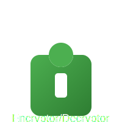

# En-De-cryptor
- encrypt Text And Massage Etc.
    - verify Easley.

---

# Encryptor/Decryptor Tool for encrypt Text And Massage Etc.

## Overview

The **Encryptor/Decryptor Tool** is a Python application that allows users to easily encrypt and decrypt messages using symmetric encryption. This tool utilizes the `cryptography` library for secure encryption and decryption, and provides a user-friendly interface powered by the `rich` library and an ASCII banner created with `pyfiglet`.

## Features

- Generate secure encryption keys.
- Encrypt messages with the generated keys.
- Decrypt messages using the corresponding keys.
- Interactive and colorful user interface.
- Easy-to-use command-line tool.

## Requirements

- Python 3.6 or higher
- `cryptography` library
- `rich` library
- `pyfiglet` library

## Installation

To set up this project, follow these steps:

1. **Clone the repository** (if applicable):
   ```bash
   git clone https://github.com/rkstudio585/En-De-cryptor.git
   cd En-De-cryptor
   ```

2. **Install the required libraries**:
   You can install the necessary libraries using pip. Run the following command in your terminal:
   ```bash
   pip install rich cryptography pyfiglet
   ```

## Usage

1. **Run the Tool**:
   To start the tool, execute the following command in your terminal:
   ```bash
   python main.py
   ```

2. **Select an Option**:
   You will see a menu with the following options:
   ```
   [1] Generate Key
   [2] Encrypt Message
   [3] Decrypt Message
   [4] Exit
   ```

   - **Option 1 - Generate Key**: This option generates a new Fernet key for encryption. Copy the generated key for later use.

   - **Option 2 - Encrypt Message**: Select this option to encrypt a message.
     - Enter the previously generated key when prompted.
     - Enter the message you wish to encrypt.
     - The tool will output the encrypted message.

   - **Option 3 - Decrypt Message**: Choose this option to decrypt a previously encrypted message.
     - Enter the same key that was used for encryption.
     - Input the encrypted message.
     - The tool will display the decrypted message.

   - **Option 4 - Exit**: This option will terminate the tool.

## Example Workflow

Here’s an example of how to use the tool:

1. **Generate a Key**:
   ```
   Choose an option:
   [1] Generate Key
   [2] Encrypt Message
   [3] Decrypt Message
   [4] Exit
   Select an option [1/2/3/4]: 1
   Generated Key: lz-kIx5ytvDtSLgaT4LJT5qo-65Y1rmJJxXQbjP0DHk=
   ```

2. **Encrypt a Message**:
   ```
   Choose an option:
   [1] Generate Key
   [2] Encrypt Message
   [3] Decrypt Message
   [4] Exit
   Select an option [1/2/3/4]: 2
   Enter your key (string): lz-kIx5ytvDtSLgaT4LJT5qo-65Y1rmJJxXQbjP0DHk=
   Enter the message to encrypt: Hello World!
   Encrypted Message: gAAAAABg1... (some encrypted text)
   ```

3. **Decrypt the Message**:
   ```
   Choose an option:
   [1] Generate Key
   [2] Encrypt Message
   [3] Decrypt Message
   [4] Exit
   Select an option [1/2/3/4]: 3
   Enter your key (string): lz-kIx5ytvDtSLgaT4LJT5qo-65Y1rmJJxXQbjP0DHk=
   Enter the message to decrypt: gAAAAABg1... (the encrypted message from above)
   Decrypted Message: Hello World!
   ```

## Dependencies

The following dependencies are required to run this tool:

- **cryptography**: A package for secure encryption and decryption. [Cryptography Documentation](https://cryptography.io/en/latest/)
- **rich**: A library for rich text and beautiful formatting in the terminal. [Rich Documentation](https://rich.readthedocs.io/en/stable/)
- **pyfiglet**: A Python implementation of the FIGlet tool for creating ASCII art text. [PyFiglet Documentation](https://github.com/pwaller/pyfiglet)


## Contributing

Contributions are welcome! If you would like to contribute to this project, please submit a pull request or open an issue.

## Contact

For questions or inquiries, please reach out to [rkriad@proton.me] or open an issue in the repository.

---

